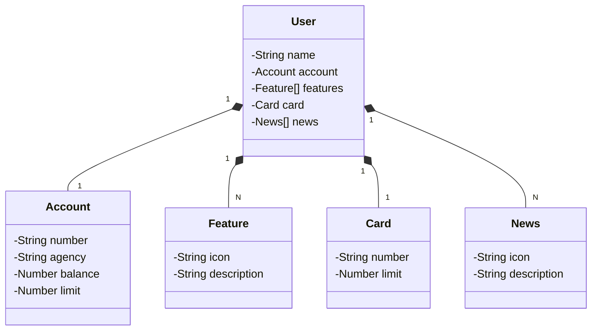

# Santander Dev Week 2023 Java API

RESTful API developed using Spring Boot and Java 17 for Santander Dev Week 2023.

## Main Tecnologies
 - **Java 17**: We will use the latest LTS version of Java;
 - **Spring Boot 3**: It's a Java application development framework that simplifies and accelerates the creation of enterprise Java applications. It provides a simplified approach to configuration, development, and deployment of applications, allowing developers to focus more on business logic and less on technical configuration. Spring Boot includes many ready-to-use features, such as an embedded web server, automatic configuration, dependency management, and more, making it easier to create robust and efficient Java applications quickly and effectively. It's widely used for developing web applications, RESTful services, and microservices in Java.
 - **Spring Data JPA**: It's a part of the Spring ecosystem that simplifies access to relational databases using the Java Persistence API (JPA). It provides abstractions and features that make it easier to interact with databases through Java objects, eliminating much of the repetitive code associated with data access.
 - **OpenAPI (Swagger)**: Swagger is an open-source tool that helps document, design, and test APIs more effectively. It allows you to create interactive documentation for your APIs, describing details such as endpoints, required parameters, response types, and even providing API testing directly within the documentation.
 - **H2**: It is an in-memory relational database that can be used in Java. It is known for being lightweight, fast, and suitable for Java application development and testing, as it does not require external database server configuration and can be embedded in Java applications.

## Class Diagram

## How to Use
Using the Eclipse IDE, right-click on your project, select "Run As > Run Configurations > Java Application > yourapplicationname > Environments," create the following environment variable SPRING_PROFILES_ACTIVE=dev, and then run the application.

## Swagger
The Swagger UI will be available at the URL: http://localhost:8080/swagger-ui/index.html

## H2
The H2 UI will be available at the URL: http://localhost:8080/h2-console

RESTful API developed using Spring Boot and Java 17 for Santander Dev Week 2023.