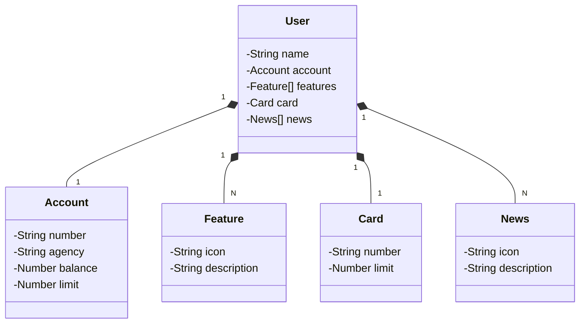

# Santander Dev Week 2023 Java API

RESTful API desenvolvida utilizando Spring Boot e JAVA 17 para a Santader Dev Week 2023

## Principais Tecnologias
 - **Java 17**: Versão LTS(Long Term Support) mais recente do Java;
 - **Spring Boot 3**: É um framework de desenvolvimento de aplicativos Java que simplifica e acelera a criação de aplicativos Java empresariais. Ele fornece uma abordagem simplificada para configuração, desenvolvimento e implantação de aplicativos, permitindo que os desenvolvedores se concentrem mais na lógica de negócios e menos na configuração técnica. O Spring Boot inclui muitos recursos prontos para uso, como um servidor web incorporado, configuração automática, gerenciamento de dependências e muito mais, o que torna mais fácil a criação de aplicativos Java robustos e eficientes de forma rápida e eficaz. É amplamente utilizado para desenvolver aplicativos web, serviços RESTful e microservices em Java.
 - **Spring Data JPA**: É uma parte do ecossistema Spring que simplifica o acesso a bancos de dados relacionais usando a API Java Persistence (JPA). Ele fornece abstrações e recursos que facilitam a interação com bancos de dados por meio de objetos Java, eliminando grande parte do código repetitivo associado ao acesso a dados
 - **OpenAPI (Swagger)**: É uma ferramenta de código aberto que ajuda a documentar, projetar e testar APIs de forma mais eficaz. Ele permite criar uma documentação interativa para suas APIs, descrevendo detalhes como os endpoints, os parâmetros necessários, os tipos de resposta e até mesmo fornecendo testes de API diretamente na documentação
 - **H2**: É um banco de dados relacional em memória que pode ser usado no Java. Ele é conhecido por ser leve, rápido e adequado para desenvolvimento e testes de aplicativos Java, pois não requer configuração externa de servidor de banco de dados e pode ser incorporado em aplicativos Java. 

## Diagrama de Classes (Domínio da API)



## Como Usar
 Utilizando a IDE eclipse, clique com o botão direito do mouse em seu projeto, selecione "Run As > Run Configurations > Java Aplication > nomedasuaaplicação > Enviroments", crie a seguinte variavel de ambiente ```SPRING_PROFILES_ACTIVE=dev``` e execute a aplicação.

## Swagger
 UI do Swagger estara disponivel na url: http://localhost:8080/swagger-ui/index.html

## H2
 UI do H2 estara disponivel na url: http://localhost:8080/h2-console

Gostaria de agradecer o Santander e todos os envolvidos na Santander Dev Week por essa oportunidade de aprendizado.